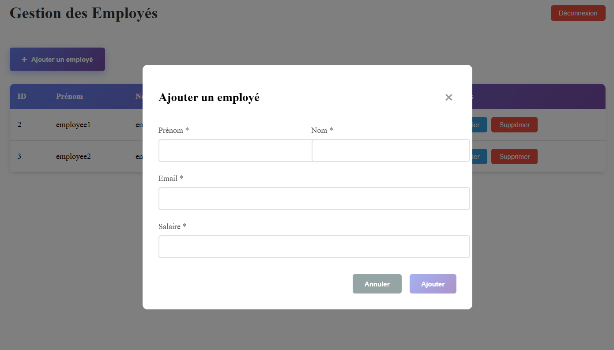
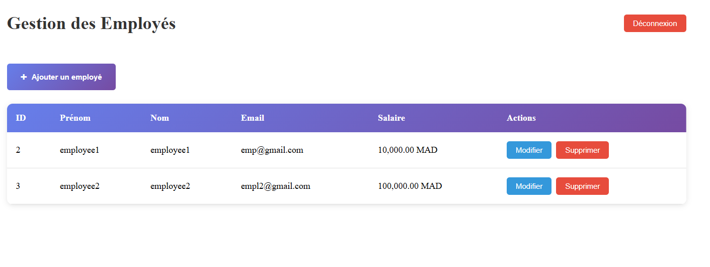
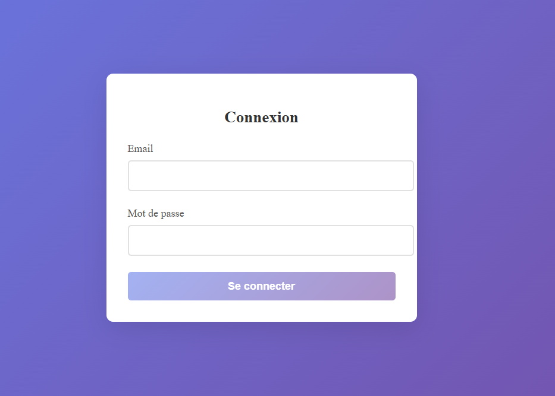
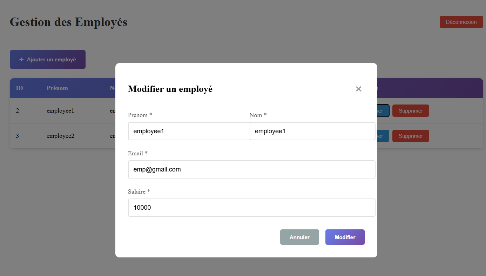

# Atelier 7 Frontend

## Introduction

 Cet atelier a pour objectif de développer une application Full-Stack permettant de gérer des employés (CRUD) avec une API sécurisée et un frontend moderne. La partie frontend, développée avec Angular, se concentre sur la création d'une interface utilisateur intuitive et réactive, tout en intégrant des fonctionnalités avancées telles que l'authentification et la gestion des employés.

Ce dépôt est exclusivement dédié à la partie frontend. La partie backend, développée avec Spring Boot, est disponible dans un dépôt séparé : [Atelier 7 Backend](https://github.com/ahyahya1616/atelier7_employee).

## Structure du Projet

Le projet est organisé comme suit :

- `src/` : Contient le code source de l'application.
  - `app/` : Dossier principal de l'application.
    - `components/` : Contient des composants réutilisables tels que `employee-list` et `login`.
    - `guards/` : Inclut les gardes de route comme `auth.guard.ts`.
    - `interceptors/` : Contient les intercepteurs HTTP comme `auth.interceptor.ts`.
    - `models/` : Définit les modèles de données tels que `auth.model.ts` et `employee.model.ts`.
    - `services/` : Fournit des services pour l'authentification et la gestion des employés.
  - `index.html` : Le fichier HTML principal.
  - `main.ts` : Le point d'entrée de l'application.
  - `styles.css` : Styles globaux pour l'application.

Le frontend communique avec le backend via des API REST pour effectuer des opérations telles que l'authentification, la gestion des employés, et bien plus encore.

### Fonctionnalités Principales

1. **Authentification** :
   - Gestion des connexions et déconnexions des utilisateurs.
   - Protection des routes grâce à des gardes d'authentification.

2. **Gestion des Employés** :
   - Ajout, modification et suppression des employés.
   - Affichage de la liste des employés avec des détails.

3. **Intercepteurs HTTP** :
   - Gestion des jetons d'authentification pour sécuriser les requêtes API.

## Captures d'Écran

Voici quelques captures d'écran de l'application :

### Page d'Ajout d'Employé1

### Page de Liste des Employés

### Page de Connexion

### Page de Modification d'Employé

## Instructions pour Exécuter le Projet

1. Clonez le dépôt.
2. Installez les dépendances avec `npm install`.
3. Lancez le serveur de développement avec `ng serve`.
4. Ouvrez l'application dans votre navigateur à l'adresse `http://localhost:4200`.

## Conclusion

La partie frontend du projet  met en œuvre les meilleures pratiques de développement Angular pour offrir une expérience utilisateur fluide et sécurisée. Grâce à l'intégration avec le backend Spring Boot, cette application Full-Stack permet une gestion efficace des employés.

